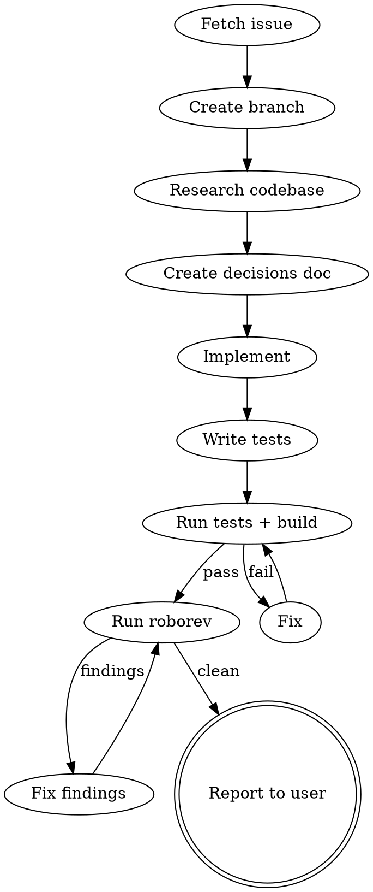

# Autonomous Issue Fix

Implement a GitHub issue from start to finish on a clean branch, tracking decisions in a document, and stopping for user review before PR submission.

## When to Use

- User says "fix issue #X" and asks you to work autonomously
- User wants an end-to-end implementation with minimal back-and-forth
- Issue has clear acceptance criteria

## Workflow



### 1. Fetch and understand the issue

```bash
gh issue view <number> --json title,body,labels,comments
```

Read the issue thoroughly. Identify acceptance criteria, edge cases, and related issues mentioned in comments.

### 2. Create a clean branch

```bash
git checkout main && git pull && git checkout -b <branch-name>
```

Use a descriptive branch name like `feature/latex-mime-support` or `fix/null-check-in-parser`.

### 3. Research the codebase

Use the Explore agent to understand the relevant architecture before writing code. Key questions:
- Where does similar functionality already exist?
- What patterns do sibling implementations follow?
- What infrastructure can be reused?

### 4. Create a decisions document

Write a tracking document (e.g., `thoughts/agent-notes/<feature>-decisions.md`) covering:
- **Problem statement** (from the issue)
- **Architecture decision** with alternatives considered and why one was chosen
- **Key assumptions** that could be wrong
- **Test cases** derived from the issue
- **Files to modify** (planned)

Update this document as decisions evolve during implementation.

### 5. Implement

- Follow existing codebase patterns
- Commit logical units as you go (per CLAUDE.md conventions)
- Keep changes minimal and focused on the issue

### 6. Write tests

- Test at the lowest level that covers the behavior
- Cover the golden path and edge cases from the issue
- Follow the project's test conventions

### 7. Verify

- Run the build system and fix errors
- Run relevant test suites
- Run linters/precommit checks
- Run automated code review (`/roborev-review-branch` or equivalent) and fix findings

### 8. Report to user

Present a summary:
- What was implemented
- Key decisions made (with rationale)
- Test coverage
- Any scope limitations or follow-up work noted
- Demo code or steps to manually verify (if applicable)

**Do NOT submit a PR** unless the user explicitly asks. Stop here for review.

## Key Principles

- **Decisions doc over asking** -- when a reasonable default exists, document the assumption and move forward. Only ask when the choice is genuinely ambiguous or high-stakes.
- **Reuse over reinvent** -- always check for existing infrastructure before building new.
- **Test before done** -- never report completion without passing tests and a clean build.
- **Scope discipline** -- fix the issue, not the neighborhood. Note follow-up work separately.

## Common Mistakes

| Mistake | Fix |
|---------|-----|
| Asking for permission at every step | Document assumptions, keep moving |
| Implementing before understanding the architecture | Research first with Explore agent |
| Skipping the decisions doc | Future you (and reviewers) need the context |
| Reporting done without running tests | Always verify build + tests before reporting |
| Submitting a PR without user review | Stop and present findings; let user decide next step |
