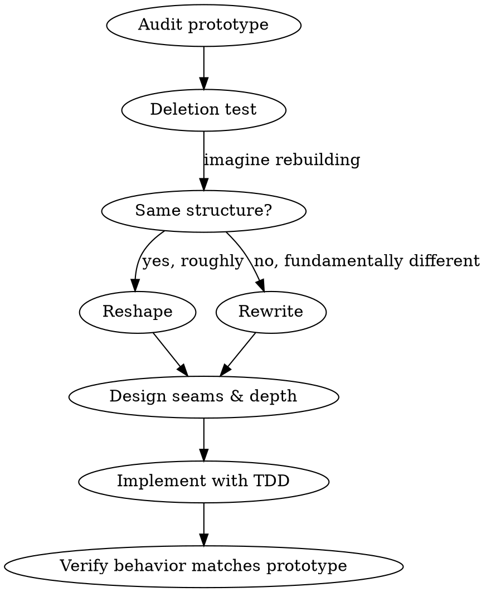

# Productionize

**Take validated prototype code and decide: reshape it or rewrite it. Then do the work using deep-module principles.**

## When to Use

- Prototype branch exists and the idea is validated
- User says "productionize", "make this real", "ship this properly", "promote this"
- After `/prototyping` wrap-up, when the decision is "build properly"

**NOT:** When the prototype hasn't been tried yet (go back to prototyping). When the code is already production-quality (use improve-codebase-architecture directly).

## Process

### 1. Audit the prototype

Read the prototype branch. Identify:

- **What it does** -- the validated behavior to preserve
- **Where it's hacky** -- find `// HACK:`, `// TODO:`, duplicated code, hardcoded values, missing error handling
- **What's coupled** -- where are the implicit dependencies, shared state, ordering assumptions?
- **What's shallow** -- apply the vocabulary from improve-codebase-architecture (module, interface, depth, seam, leverage, locality) to spot pass-throughs and thin wrappers

Present a short summary: "Here's what the prototype does, here's where the architectural friction lives."

### 2. Rewrite vs. Reshape

This is the critical decision. Present both options honestly:

**Reshape (refactor in place):**
- Start from the prototype branch, incrementally improve
- Good when: the prototype's structure roughly matches what production needs, the happy path is correct, the main issue is missing error handling / tests / abstractions
- Risk: prototype assumptions baked into the structure may fight you

**Rewrite (fresh implementation informed by prototype):**
- Start a new branch, use the prototype as a reference spec
- Good when: the prototype taught you something that invalidates its own structure, the coupling is deep enough that untangling costs more than rebuilding, or the prototype was exploring multiple approaches and only one won
- Risk: you might re-introduce bugs the prototype already solved

**Apply the deletion test:** Imagine deleting the prototype code entirely. If you'd rebuild it with roughly the same structure, reshape. If you'd build something fundamentally different now that you know what works, rewrite.

Ask the user: "Based on this analysis, I recommend [reshape/rewrite] because [reason]. Want to proceed, or do you see it differently?"

### 3. Design the production architecture

Invoke `/improve-codebase-architecture` on the code you're about to write (or reshape). It handles the full workflow: exploring for shallow modules, presenting deepening candidates, grilling the user on seam placement and interface design.

The difference from a normal architecture review: scope it to the prototype's footprint, not the whole codebase. The prototype tells you what the module boundaries should be -- the architecture skill tells you how to make them deep.

### 4. Implement

**If reshaping:**
- Create a new branch off the prototype branch (e.g., `feat/<name>`)
- Work incrementally: one module at a time, tests before each change
- Preserve the validated behavior -- prototype is the spec

**If rewriting:**
- Create a new branch off main (e.g., `feat/<name>`)
- Use the prototype as a reference for expected behavior
- Build with tests from the start -- the prototype tells you what to test

In both cases:
- Follow TDD (use superpowers:test-driven-development)
- Remove all `// HACK:` and `// TODO:` markers -- they become real implementations or deliberate decisions
- Apply deep-module principles: concentrate knowledge, minimize interfaces, earn every seam with two adapters

### 5. Wrap up

- Run full test suite, verify the production version matches prototype behavior
- Summarize: what changed architecturally and why
- Offer to clean up or delete the prototype branch
- Use superpowers:finishing-a-development-branch for merge/PR options

## Decision Framework

## Common Mistakes

| Mistake | Fix |
|---------|-----|
| Refactoring without understanding what the prototype validated | Audit first -- the behavior is the spec |
| Rewriting and losing edge cases the prototype discovered | Use prototype as test oracle |
| Keeping prototype abstractions that were expedient, not deep | Apply deletion test to every module |
| Adding seams "just in case" | One adapter = hypothetical. Earn every seam. |
| Gold-plating beyond what's needed | Ship the production version of what was prototyped, not more |
