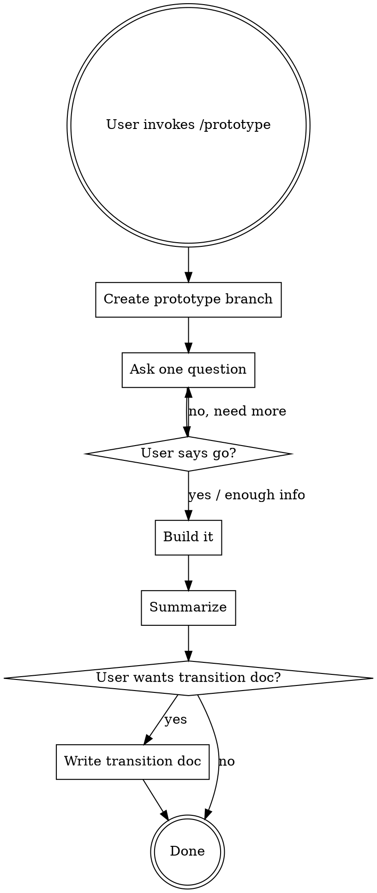

# Rapid Prototyping

Get from idea to working prototype as fast as possible. Speed over polish. Ship something you can try, then decide if it's worth building properly.

**Announce at start:** "Entering prototype mode -- prioritizing speed over polish."

## Override: Skip Process Skills

**Do NOT invoke these skills during prototyping:**
- brainstorming (no spec needed)
- writing-plans (no plan needed)
- executing-plans (no plan to execute)
- test-driven-development (no tests required)
- requesting-code-review (no review needed)
- verification-before-completion (lightweight wrap-up instead)
- subagent-driven-development (just build it directly)

**Still respect:**
- Security basics (no SQL injection, XSS, etc.)
- Existing project structure and patterns (build where things belong)
- User's CLAUDE.md preferences

## The Process

### Step 1: Create Branch

Create a `prototype/<name>` branch off current HEAD before touching any code. Pick a short descriptive name from what the user described (e.g., `prototype/drag-and-drop-reorder`).

### Step 2: Gather Requirements (Adaptive)

Ask questions **one at a time** to understand what to build. Focus on:
- What does this thing do? (the happy path)
- Where does it live in the codebase?
- What should the user see/experience?

**Stop asking and start building when:**
- The user says "go", "enough", "just build it", or similar
- You have enough to build a reasonable first pass (even if details are fuzzy -- make your best guess and move on)

Keep it to ~3 questions max unless the user is volunteering more detail. Bias toward starting.

### Step 3: Build Fast

**Mindset:** "Don't overthink it, just get something working."

- Implement directly in the real codebase -- no throwaway sandboxes
- Follow existing project patterns loosely but don't stress about perfection
- Duplicate code is fine if it's faster than abstracting
- Skip tests entirely
- Skip error handling for edge cases that don't affect the happy path
- Use `// HACK: <reason>` comments for particularly rough spots that would be confusing later
- Use `// TODO: <what>` comments for things you're deliberately skipping
- Commit as you go with `prototype: <what>` commit messages
- If something is unclear, make your best guess and keep moving -- don't stop to ask

**What "fast" means:**
- Pick the most straightforward implementation, not the most elegant
- If there are two ways to do something, pick the one you can build in fewer steps
- Don't refactor surrounding code to make things cleaner
- Don't add types/interfaces unless the language requires it
- Don't write docstrings or documentation
- Don't optimize performance

### Step 4: Wrap Up

When the prototype is functional, summarize in a message:

1. **What was built** -- brief description of what the prototype does
2. **How to try it** -- how to run/see/use the prototype
3. **What's hacky** -- list the major shortcuts and rough spots
4. **What would need work** -- what you'd address if productionizing this

Then ask: "Want me to write this up as a transition doc for a future cleanup session?"

If yes, write a short markdown file at `docs/prototype-notes/<branch-name>.md` with the above sections and commit it to the prototype branch.

## Red Flags -- You're Overthinking It

| Thought | What to do instead |
|---------|-------------------|
| "I should write tests for this" | No. Build it, try it manually. |
| "Let me refactor this first" | No. Work with what's there. |
| "This needs a proper abstraction" | No. Inline it. Duplicate if needed. |
| "I should handle this edge case" | No. Happy path only. |
| "Let me check if there's a better library" | Use what's already in the project. |
| "This won't scale" | It doesn't need to. It's a prototype. |
| "I need a design doc" | You're in prototype mode. Just build. |
| "Let me add types for this" | Only if the compiler demands it. |
